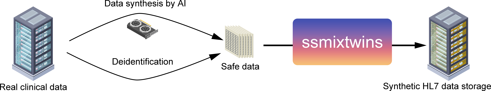

ssmixtwinsについて
=================

概要
-----

SS-MIX2は日本国内の臨床情報を保存するための標準です。日本国内では1000以上の施設に導入されおり、SS-MIX2に準拠して保存されたデータをSS-MIX2ストレージと呼びます。
SS-MIX2ストレージを用いることで、患者データを共有したり、患者データを活用したアプリケーション開発が可能になります。

しかし、SS-MIX2ストレージには個人情報が含まれており、実データを用いてアプリケーション開発を行うことは難しい場合があります。
ssmixtwinsはこの問題を解消するため、研究開発用のダミーSS-MIX2ストレージを生成するPythonパッケージとして開発されました。

ssmixtwinsは最小限の臨床データをもとに、SS-MIX2ストレージを生成します (図)。
従って、データを生成する場合は少量の元となるデータをご自身でご準備いただく必要があります(詳細は :doc:`CSVデータ詳細 <source_data>` をご覧ください)。
このデータをもとに、ssmixtwinsがオーダー番号やアレルギー情報などのダミーデータを追加し、本物らしいSSMIX2ストレージを構築します。

生成されるデータは、SS-MIX2の仕様に準拠しております。詳細は `SS-MIX2の公式ガイドライン <https://www.jami.jp/jamistd/ssmix2/>`_ をご覧ください。現在、ssmixtwinsはSS-MIX2ガイドラインのバージョン1.2hに準拠しています。

このページでは、主に生成されたデータを使用する方向けに、ssmixtwinsにより生成されるデータの詳細を説明します。

（開発者向けのマニュアルは  :doc:`データ生成マニュアル <tutorial>` をご覧ください。）

ストレージの構造
----------------

生成されたSSMIX2ストレージは、以下のような構造になっています:

.. code-block:: text

    ├── ssmixtwins/
        ├── 123/ # 患者IDの先頭3桁
        │   ├── 001 # 患者IDの4–6桁目
        │   │   ├── ...    
        │   ├── 002
        │        ├── 1230020001 # 患者IDと一致したディレクトリ
        │        │    ├── - # 診療日ごとに関連されないファイルを管理する'-'フォルダ
        │        │    │   ├── ADT-00 # 患者基本情報を含むディレクトリ
        │        │    │   ├── PPR-01 # 診断情報を含むディレクトリ
        │        │    │   ├── ...
        │        │    ├── 20250710 # 診療日ごとのディレクトリ  
        │        │        ├── OMP-01 # 処方オーダーを含むディレクトリ
        │        │        ├── OMP-02 # 注射オーダーを含むディレクトリ
        │        │        ├── OML-11 # 検体検査結果を含むディレクトリ
        │        │        ├── ... # その他のHL7メッセージディレクトリ
        │        ├── 1230020002
        │        ├── 1230020003
        │        ├── ...    
        ├── 125/
   

これはSS-MIX2に準拠したディレクトリ構造です。各患者フォルダにはさらに診療日ごとのフォルダが存在し、その中に各種臨床データがHL7 version 2.5 メッセージとして格納されています。診断や患者基本情報など、診断日ごとに分けられないデータは'ハイフン(-)'フォルダに格納されます。

HL7メッセージについて
-------------------
HL7メッセージは、医療情報を交換するための標準フォーマットです。ssmixtwinsでは、HL7 version 2.5に準拠したメッセージを生成します。
このメッセージはテキストファイルで、CSVがコンマ(,)で区切られるように、データを縦棒(|)で区切った構造化データとなっています。
これはSS-MIX2の仕様に従い、 **全てISO-2022-JPでエンコードされます。**

それぞれのメッセージファイルは、以下のような名前で保存されます:

.. code-block:: text

    <患者ID>_<診療日>_<データ種別>_<オーダ No>_<発生日時:YYYYMMDDHHMMSSFFF>_<診療科コード>_<コンディションフラグ>

例えば、OML-11メッセージのファイル名は以下のようになります:

.. code-block:: text

    1230020001_20250710_OML-11_3210000001_20250710123012752_004_1

コンディションフラグは1が有効、0が無効、2が過去履歴を表します。ssmixtwinsで生成されるデータは全てコンディションフラグが1に設定されます。

患者基本情報 (ADT-00)
-----------------------
患者名、住所、生年月日などの情報はADT-00メッセージとして格納されます。
生年月日と性別はCSV元データを参照します。必要に応じて、データ生成の段階で日付と年齢、性別はあらかじめダミーの値を設定してください ( :doc:`CSV元データ <source_data>` )。

患者名や住所などそのほか全てのデータは本物らしいですが、 **全て実在の患者とは無関係** のため、安全にデータを使用できます。

.. csv-table:: 患者基本情報
    :header: "データ", "関連セグメント", "詳細"

    "患者ID", "PID-3", "衝突しない10桁の数字を生成。"
    "生年月日", "PID-7", "元データを参照。"
    "性別", "PID-8", "元データを参照。M:男性, F:女性, O:その他, U:不明, A:両性具有, N:適応外のいずれかだが、主にMかF。"
    "患者名", "PID-5", "性別に応じてランダムな男性名、女性名を生成。実在の名前とは無関係。"
    "郵便番号", "PID-11", "ランダムな日本の郵便番号らしいデータを生成。実在の郵便番号とは無関係。"
    "住所", "PID-11", "ランダムな日本の住所らしいデータを生成。実在の住所とは無関係。"
    "電話番号", "PID-13, 14", "ランダムな日本の電話番号らしいデータを生成。実在の電話番号とは無関係。"
    "最終更新日時", "PID-33", "全レコードの最終日時を使用。"
    "アレルギー", "AL1", "患者ごとに0~数件のアレルギー情報をランダムで付与。一部J-FAGYコードを使用。"
    "ABO血液型", "OBX", "ランダムなABO血液型を生成 (A>O>B>ABの頻度）。"
    "Rh因子", "OBX", "ランダムなRh因子を生成 (Rh+>>Rh-)。"
    "身長", "OBX", "ランダムな身長を生成 (平均172cm, 標準偏差6cm程度)。"
    "体重", "OBX", "ランダムな体重を生成 (平均60kg, 標準偏差10kg程度)。"
    "保険プランID", "IN1-2", "JHSD 表 0001-保険種別からランダム。ただし国民健康保険(C0)が多くなっている。"
    "保険者番号", "IN1-3", "国民健康保険は6桁、そのほかの保険は8桁のランダムな数字。実在の保険者番号とは無関係。"
    "保険会社名", "IN1-4", "固定値"
    "被保険者グループ雇用者 ID", "IN1-10", "固定値"
    "被保険者グループ雇用者名", "IN1-11", "固定値"
    "保険:プラン有効日付", "IN1-12", "最終更新日時とほぼ同等"
    "保険:プラン失効日付", "IN1-13", "プラン有効日付から一年後"
    "保険:プランタイプ", "IN1-15", "必要に応じてJHSD 表 0002-保険のプランタイプからランダム。"
    "保険:被保険者と患者の関係", "IN1-17", "本人(SEL)で固定。"
    "患者の職場", "NK1-13", "ランダムな職場名を生成。小児は常に空欄。"

入院情報 (ADT-22)
----------------
入院情報はADT-22メッセージとして格納されます。

.. csv-table:: 入院情報
    :header: "データ", "関連セグメント", "詳細"

    "入院日時", "PV1-44", "元データを参照。"
    "病棟コード", "PV1-3", "ランダムな病棟を生成。"
    "病室コード", "PV1-3", "ランダムな病室を生成。"
    "ベッド番号", "PV1-3", "ランダムな番号を生成。"
    "主治医",  "PV1-7", "ランダムに医師を選択。"
    "入院時医師", "PV1-17", "ランダムに医師を選択。"

退院情報 (ADT-52)
----------------
退院情報はADT-52メッセージとして格納されます。

.. csv-table:: 退院情報
    :header: "データ", "関連セグメント", "詳細"

    "退院区分", "PV1-36", "元データを参照。生存退院なら'01'、死亡退院なら'20'などの退院区分を表すコード。"
    "退院日時", "PV1-45", "元データを参照。"
    "病棟コード", "PV1-3", "ADT-22で設定されたものと同じ。"
    "病室コード", "PV1-3", "ADT-22で設定されたものと同じ。"
    "ベッド番号", "PV1-3", "ADT-22で設定されたものと同じ。。"
    "主治医", "PV1-7", "ADT-22で設定されたものと同じ。"
    "入院時医師", "PV1-17", "ADT-22で設定されたものと同じ。"

外来受診 (ADT-12)
-----------------
外来受診情報はADT-12メッセージとして格納されます。

他のレコード(OML-11, OMP-01, OMP-02など)と矛盾のないように、適宜ADT-12メッセージを生成します。

.. csv-table:: 外来受診情報
    :header: "データ", "関連セグメント", "詳細"

    "受診日時", "PV1-44", "他のレコードに60~180分ほど先行するように設定。入院中は無し。"
    "診療科", "PV1-3", "基本的に主治医の診療科に一致するようSS-MIX2 統一診療科コード表から選択。"
    "主治医", "PV1-7", "ランダムに医師を選択。"

診断 (PPR-01)
----------------
診断情報はPPR-01メッセージとして格納されます。

.. csv-table:: 診断情報
    :header: "データ", "関連セグメント", "詳細"

    "アクションコード", "PRB-1", "基本的に全てAD"
    "アクション日時", "PRB-2", "元データを参照。"
    "病名コード", "PRB-3", "8桁の病名管理番号を使用する。元データを参照。"
    "病名", "PRB-3", "元データを参照。"
    "プロブレムインスタンス ID", "PRB-4", "衝突しないランダムな数字を生成。"
    "疑い病名フラグ", "PRB-13", "元データを参照。"
    "診断日時", "PRB-7", "アクション日時 − 0~1日程度のランダムな時間を設定。"
    "予想されるプロブレム解決日付", "PRB-8", "アクション日時 + 0~30日程度のランダムな時間を設定。"
    "ICD-10コード", "PRB-10", "元データを参照。"
    "診断種別", "PRB-10", "JHSD 表 0004-診断種別からランダムに選択。"
    "発症日時", "PRB-16", "アクション日時 − 0~30日程度のランダムな時間を設定。"

処方オーダー (OMP-01)
--------------------
処方オーダー情報はOMP-01メッセージとして格納されます。

.. csv-table:: 処方オーダー情報
    :header: "データ", "関連セグメント", "詳細"

    "薬剤コード", "RXE-2", "HOTコードを使用する。元データを参照。"
    "薬剤名", "RXE-2", "元データを参照。"
    "与薬量－最小", "RXE-3", "固定値"
    "与薬単位", "RXE-5", "可能な限り薬剤名から推定。不可の場合は固定値。"
    "与薬剤形", "RXE-6", "可能な限り薬剤名から推定。不可の場合は固定値。"
    "調剤量", "RXE-10", "ランダムな数量を生成。"
    "調剤単位", "RXE-11", "与薬単位と同じ。"
    "処方箋番号", "RXE-15", "衝突しないランダムな番号を生成。"
    "繰返しパターン", "TQ1-3", "いくつかのパターンからランダムに選択。"
    "投与日数", "TQ1-6", "入院、外来に応じてランダムな日数を生成。"
    "開始日時", "TQ1-7", "元データを参照。"
    "投与経路", "RXR-1", "可能な限り薬剤名から推定。不可の場合は固定値。"

注射オーダー (OMP-02)
--------------------
注射オーダー情報はOMP-02メッセージとして格納されます。

.. csv-table:: 注射オーダー情報
    :header: "データ", "関連セグメント", "詳細"

    "注射種別", "RXE-2", "JHSI 表 0002-注射種別に基づく固定値 (01)"
    "与薬量－最小", "RXE-3", "固定値"
    "与薬単位", "RXE-5", "固定値"
    "与薬剤形", "RXE-6", "固定値 (INJ)"
    "調剤量", "RXE-10", "ランダムな数量を生成。"
    "調剤単位", "RXE-11", "与薬単位と同じ。"
    "処方箋番号", "RXE-15", "衝突しないランダムな番号を生成。"
    "成分タイプ", "RXC-1", "AまたはBを成分名から可能な限り推定。"
    "成分コード", "RXC-2", "HOTコードを使用する。元データを参照。"
    "成分名", "RXC-2", "元データを参照。"
    "成分量", "RXC-3", "ランダムな数量を生成。"
    "成分単位", "RXC-4", "成分タイプに応じた固定値。"
    "開始日時", "TQ1-7", "元データを参照。"
    "投与経路", "RXR-1", "固定値。"
    "投薬装置", "RXR-3", "固定値。"

検体検査結果 (OML-11)
----------------------
検体検査結果はOML-11メッセージとして格納されます

.. csv-table:: 検体検査結果
    :header: "データ", "関連セグメント", "詳細"

    "値型", "OBX-2", "結果値から推定 (数値or文字列)。"
    "検査コード", "OBX-3", "17桁JLAC10コードを使用する。元データを参照。"
    "検査名称", "OBX-3", "元データを参照。"
    "検査値", "OBX-5", "元データを参照。"
    "単位", "OBX-6", "元データを参照。"
    "検査結果状態", "OBX-11", "固定値"
    "検査項目ID", "OBR-4", "検査コードから、適切なIDをJLAC10より設定する。"
    "検体採取日時", "OBR-7, SPM-17", "元データを参照。"
    "検体採取終了日時", "OBR-8", "検体採取日時と一致。"
    "結果報告/状態変更-日時", "OBR-22", "検体採取日時 + 30~180分程度のランダムな時間を設定。"
    "検体 ID", "SPM-2", "衝突しないランダムな番号を生成。"
    "検体タイプ", "SPM-4", "検査コードのJLAC10より、適切な検体タイプを設定する。"

そのほかの情報
----------------
オーダー番号やメッセージID、メッセージ時刻、医師名、病院名など、さまざまなメッセージで使われるデータの詳細については、以下の表を参照してください。

病院はひとつの病院のデータ(病院名、郵便番号、住所、電話番号など)が生成され、その一つを使いまわします。複数の病院が出現することはありません。

医師は30名程度のデータ(医師名、医師ID、所属診療科など)が生成され、これらの医師が各種メッセージで使いまわされます。

患者の経過中、主治医や入院担当医が時折変わるように設定されています。オーダー依頼者や入力者はランダムですが、
できるだけ本物らしくするために、高い確率で主治医か入院担当医が選ばれれるようになっています。

.. csv-table:: その他の情報
    :header: "データ", "関連セグメント", "詳細"

    "メッセージID", "MSH-10", "衝突しないランダムな最大20桁の番号を生成。"
    "メッセージ時刻", "MSH-7", "各種レコードに矛盾ない時刻を設定。"
    "オーダー制御", "ORC-1", "基本的に全てNW"
    "依頼者オーダー番号", "ORC-2", "衝突しないランダムな15桁の番号を生成。左ゼロ埋め。"
    "実施者オーダー番号", "ORC-3", "衝突しないランダムな15桁の番号を生成。左ゼロ埋め。"
    "トランザクション時刻", "ORC-9", "各種レコードに矛盾ない時刻を設定。"
    "オーダー入力者", "ORC-10", "ランダムな医師。"
    "オーダー依頼者", "ORC-12", "ランダムな医師で、主にオーダー入力者と同じ。"
    "オーダ有効日時", "ORC-15", "各種レコードに矛盾ない時刻を設定。"
    "オーダータイプ", "ORC-29", "入院中ならI, 外来中ならOが正しく設定される。"
    "病院名", "ORC-21など", "固定値"
    "病院郵便番号", "ORC-22", "ランダムな日本の郵便番号を生成。"
    "病院住所", "ORC-22", "ランダムな日本の住所を生成。"
    "病院電話番号", "ORC-23", "ランダムな日本の電話番号を生成。"
    "診療科", "PV1-3など", "SS-MIX2 統一診療科コード表から選択。医師に対して割り当てられており、主治医か入院担当医の診療科が主に選ばれる。"
   
